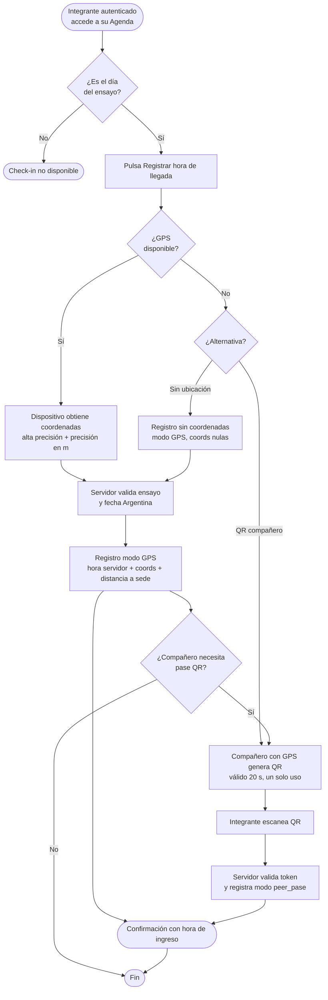
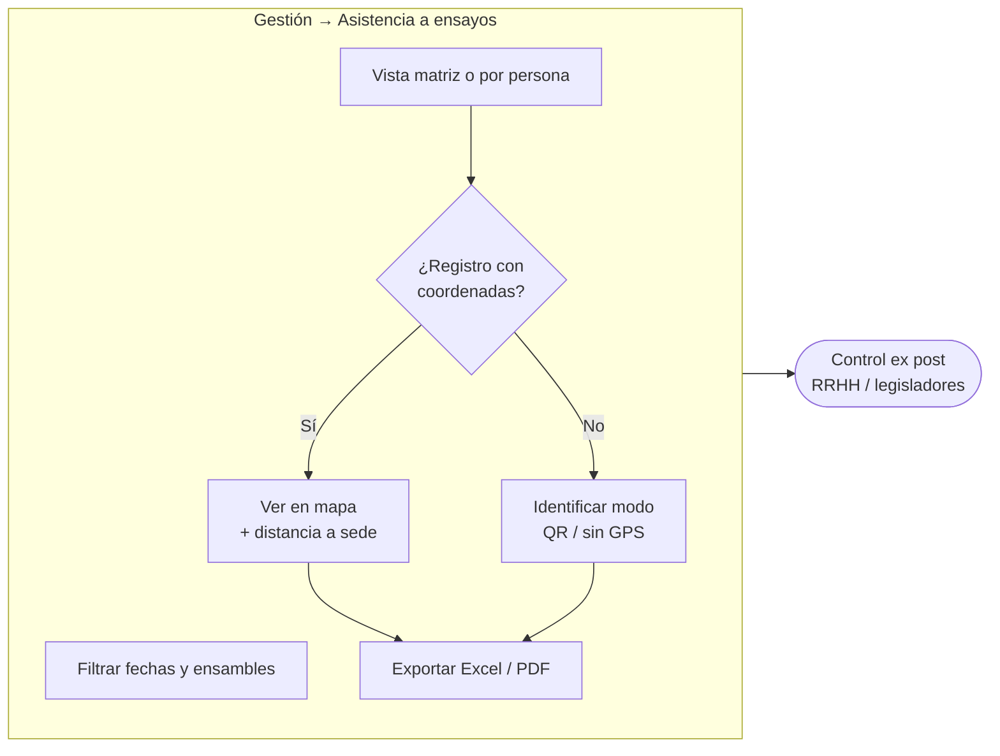

# Diagrama de flujo — Registro de ingreso a ensayos de ensamble

**Orquesta Filarmónica de Río Negro (OFRN)**

> Versión interactiva con renderizado visual: abrir [`diagrama-flujo.html`](./diagrama-flujo.html) en el navegador.

---

## Flujo principal del integrante

---

## Flujo de supervisión y auditoría (Gestión)

---

## Leyenda de modalidades

| Modalidad | Descripción |
|-----------|-------------|
| **GPS directo** | Coordenadas propias del integrante. Evidencia geográfica principal. |
| **Pase QR (`peer_pase`)** | Ubicación del compañero presente. Token efímero 20 s, uso único. |
